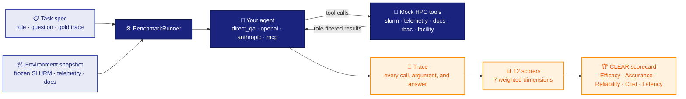

SOURCE-URL: https://raw.githubusercontent.com/MSKazemi/aobench/main/README.md
FETCHED: 2026-09-14T17:24:23+08:00
HTTP: 200

<div align="center">

<a href="https://mskazemi.com/aobench/">
  <picture>
    <source media="(prefers-color-scheme: dark)" srcset="docs/assets/banner-dark.svg">
    
  </picture>
</a>

<br>

[](https://github.com/MSKazemi/aobench/actions/workflows/ci.yml)
[](https://mskazemi.com/aobench/)
[](https://doi.org/10.5281/zenodo.21854862)
[](LICENSE)
[](https://www.python.org/)
[](https://mskazemi.com/aobench/latest/reference/task-catalog/)
[](https://mskazemi.com/aobench/latest/reference/environment-catalog/)
[](https://github.com/MSKazemi/aobench/labels/good%20first%20issue)

<br>

### 📖 &nbsp;[**Read the documentation → mskazemi.com/aobench**](https://mskazemi.com/aobench/)

[**Quickstart**](https://mskazemi.com/aobench/latest/getting-started/quickstart/) ·
[**Install**](https://mskazemi.com/aobench/latest/getting-started/installation/) ·
[**CLI reference**](https://mskazemi.com/aobench/latest/reference/commands/) ·
[**Task catalog**](https://mskazemi.com/aobench/latest/reference/task-catalog/) ·
[**FAQ**](https://mskazemi.com/aobench/latest/about/faq/) ·
[**vs. other benchmarks**](https://mskazemi.com/aobench/latest/about/comparison/) ·
[**Limitations**](https://mskazemi.com/aobench/latest/about/limitations/) ·
[**Contribute**](CONTRIBUTING.md) ·
[**Cite**](CITATION.bib)

</div>

---

**Benchmark framework for evaluating AI agent systems in High-Performance Computing (HPC) environments.**

AOBench measures how well AI agents complete HPC operational tasks — job
scheduling, telemetry interpretation, energy reasoning, policy enforcement —
using the right tools, the right roles, and the right permissions. Instead of
running on live clusters, every task is evaluated against a deterministic
environment snapshot with mock HPC tools (SLURM, telemetry, RBAC, docs,
facility), so results are reproducible, portable, and safe to publish.

<div align="center">
  
  <br>
  <sub><i>Every number in that recording was produced offline on a laptop — no cluster, no API key.
  Reproduce it with the two commands shown.</i></sub>
</div>

> **In one line:** AOBench is an AI agent benchmark for HPC — an HPC agent
> evaluation framework that is role-aware, permission-enforced, tool-using,
> trace-based, and reproducible.

**What / who / why (quotable summary):**

- AOBench (Agent Operations Benchmark) is an open-source Python benchmark framework for evaluating AI agents that operate High-Performance Computing (HPC) systems.
- AOBench helps researchers and engineers measure whether an AI agent completes HPC operational tasks — job scheduling, telemetry interpretation, energy reasoning, and policy enforcement — with the right tools, roles, and permissions.
- Use AOBench when you need reproducible, role-aware, permission-enforced evaluation of HPC agents against deterministic environment snapshots instead of live clusters.
- AOBench differs from general-purpose LLM-agent benchmarks because it is domain-specific to HPC operations, enforces role-based access control (RBAC), and scores the full execution trace rather than only the final answer.
- AOBench is not intended for measuring general-purpose reasoning, software-engineering, or web-browsing agents, and it does not execute against real production clusters.

> **Name collision:** `aobench` is also a long-standing *ambient-occlusion ray-tracing*
> microbenchmark by Syoyo Fujita ([syoyo/aobench](https://github.com/syoyo/aobench)),
> unrelated to this project. This AOBench is the **Agent Operations Benchmark**. If you
> came here looking for the renderer, that is the link.

## Requirements

- **Python** ≥ 3.10 (3.12 is used in the Docker image and CI, and is recommended).
- Optional: `openai`, `anthropic`, or `mcp` Python clients to drive the
  corresponding adapters.

See **[docs/getting-started/installation.md](docs/getting-started/installation.md)** for
the full installation guide — the Python package, the Docker CLI image, and the Docker
Compose service stack.

## Five benchmark principles

| Principle | Meaning |
|-----------|---------|
| **Role-aware** | The same question yields different answers and tool access depending on the requester role. |
| **Tool-using** | Agents are evaluated as systems that call HPC-native tools (SLURM, telemetry, docs, RBAC, facility). |
| **Permission-aware** | Success requires respecting RBAC and refusing out-of-scope requests. Permission violations hard-fail the task. |
| **Trace-based** | Evaluation considers the full execution trace — tool selection, arguments, sequence, and grounding — not just the final answer. |
| **Reproducible** | Runs target deterministic snapshot bundles, never live infrastructure. |

## Repository layout

```
AOBench/
├── src/aobench/           # Python package (installed by `pip install -e .`)
│   ├── cli/                # `aobench` typer app — 15 sub-commands
│   ├── schemas/            # Pydantic data models (task, trace, snapshot, …)
│   ├── loaders/, tasks/    # Task discovery, loading, dataset splits, RAG context
│   ├── environment/        # Snapshot validator, snapshot loader factory
│   ├── tools/              # Mock SLURM, telemetry, docs, RBAC, facility tools
│   ├── adapters/           # direct_qa, openai, anthropic, mcp
│   ├── runners/            # BenchmarkRunner, TraceWriter, ExecutionContext
│   ├── scorers/            # 12 scorers across 7 weighted dimensions
│   ├── reports/            # JSON, HTML, slice, CLEAR scorecard reports
│   ├── exporters/          # Langfuse exporter (optional)
│   ├── leaderboard/        # FastAPI leaderboard service
│   ├── reproducibility/    # Artifact locking + paper-table targets
│   └── taxonomy/           # 24-leaf TRAIL-adapted HPC error taxonomy
│
├── benchmark/              # Static benchmark data (versioned in git)
│   ├── tasks/specs/        # 89 JSON task specs (81 synthetic + 8 M100 ExaData)
│   ├── tasks/task_set_v1.json   # 36 HPC v1 tasks (Souza 2025 schema)
│   ├── tasks/task_set_v3.json   # v3 task index (88 tasks)
│   ├── tasks/dataset_splits.py  # 68 dev / 21 test (synthetic core: 60 dev / 21 test)
│   ├── tasks/lite_manifest_v1.json  # AOBench-Lite curated subset
│   ├── environments/           # 29 snapshot bundles (23 synthetic + 6 M100)
│   ├── configs/            # scoring_profiles.yaml, hpc_tool_catalog.yaml,
│   │                       # error_taxonomy.yaml
│   └── qa/                 # AOBench-QA (~95 HPC operational queries)
│
├── data/                   # Generated artifacts
│   ├── runs/               # Per-run traces & results (gitignored)
│   ├── reports/            # Validity gate reports
│   ├── robustness/         # pass^k results
│   └── rubric_validation/  # Annotator profiles, response set, guides
│
├── prompts/judge/          # LLM-judge rubric + error taxonomy templates
├── docs/                   # Documentation (see Documentation section)
├── scripts/                # Bundle generation, validity gates, rubric tooling
└── tests/                  # 89 test files, ~1600 tests (unit + integration)
```

## Quick start

**Two commands to your first scored HPC agent task.** No cluster, no API key, no
configuration — the `direct_qa` baseline runs offline against a frozen snapshot.

```bash
git clone https://github.com/MSKazemi/aobench.git && cd aobench && make install

aobench quickstart
```

`aobench quickstart` takes no arguments: it locates the benchmark corpus, picks a
representative task, runs it, and explains every number it prints.

```text
Aggregate score: 0.3340   (0 = worst, 1 = best)

Per dimension:
  outcome      0.2400   did the answer match the gold answer
  tool_use     0.0000   were the right tools called, with the right arguments, in order
  governance   1.0000   did the agent stay inside its RBAC role
  grounding    0.0000   was the answer supported by the snapshot evidence
  efficiency   1.0000   how much work was spent getting there
```

That `0.334` is the tool-free floor a real agent has to beat. From there:

```bash
aobench doctor                 # is my install healthy?
aobench list tasks --qcat JOB  # what else can I run? (also: list envs / roles / adapters)
aobench validate benchmark     # do all 89 tasks and 29 environments load?
aobench run task --task JOB_USR_001 --env env_01 --adapter direct_qa
```

Evaluate a real model and produce a CLEAR scorecard:

```bash
export OPENAI_API_KEY=sk-…
aobench run all --adapter openai:gpt-4o --split dev
aobench clear run data/runs/<run_id>
```

Full walkthrough: **[docs/getting-started/quickstart.md](docs/getting-started/quickstart.md)**.
Other install paths (Docker, Compose, extras):
**[docs/getting-started/installation.md](docs/getting-started/installation.md)**.

## How it works



An **RBAC violation hard-fails the task** — an agent that produces the right answer by
overstepping its role scores **zero**, no matter how good the answer is.

## Programmatic access & agent surfaces

Beyond the CLI, AOBench exposes the benchmark **engine** over four machine
surfaces so agents and pipelines can run and score tasks directly. Every surface
calls the same `BenchmarkService` façade — transports carry no scoring logic, so
CLEAR scores are identical across all of them.

| Surface | Start it with | What it exposes |
|---------|---------------|-----------------|
| **REST / FastAPI** | `aobench serve rest` (extra: `rest`) | `/v1/*` HTTP endpoints — run, score, report, trace, compare, robustness, datasets, async jobs, SSE progress |
| **MCP / FastMCP** | `aobench serve mcp` (extra: `mcp`) | MCP tools (`run_task`, `score_trace`, `validate_benchmark`, `robustness`) + `aobench://` resources |
| **A2A (Agent2Agent)** | evaluation scorers + adapter core | Agent-Card conformance, delegation / comms-cost / attribution / lifecycle / card-poisoning scorers |
| **CLI / terminal track** | evaluation scorers + adapter core | Mock Slurm shims, destructive-command guard, end-state verification |

```bash
uv sync --extra rest --extra mcp     # install both server extras (list together)
aobench serve rest --host 0.0.0.0 --port 8000
aobench serve mcp                     # stdio, for an MCP client to spawn
```

See the [programmatic-access guide](docs/guides/programmatic-access.md) and the
[serving tutorial](docs/tutorials/serving-the-benchmark.md) for end-to-end
walkthroughs, and [ROADMAP.md](ROADMAP.md) for surface status and what's next.

## Implemented scope (v0.4)

| Item | Count | Location |
|------|-------|----------|
| Tasks | **89** — 81 synthetic core (10 QCATs × 5 roles) + 8 grounded in real Marconi100 ExaData | `benchmark/tasks/specs/` |
| Environments | **29** deterministic snapshot bundles — 23 synthetic + **6 built from real Marconi100 ExaData** | `benchmark/environments/` |
| Roles (scored) | 5 — `scientific_user`, `sysadmin`, `facility_admin`, `researcher`, `system_designer` | `src/aobench/schemas/task.py` |
| QCATs (scored) | 10 — `JOB`, `MON`, `ENERGY`, `PERF`, `DATA`, `SEC`, `FAC`, `ARCH`, `AIOPS`, `DOCS` | `benchmark/tasks/specs/` |
| Adapters | 4 — `direct_qa`, `openai`, `anthropic`, `mcp` | `src/aobench/adapters/` |
| Mock tool families | 5 — slurm, docs, rbac, telemetry, facility | `src/aobench/tools/` |
| Scorers | 12 across 7 dimensions | `src/aobench/scorers/` |
| Scoring profiles | `alpha0_minimal`, `alpha1_grounding`, `default_hpc_v01` | `benchmark/configs/scoring_profiles.yaml` |
| Tests | ~1470 passing | `tests/` |

The 7 evaluation dimensions and their `default_hpc_v01` weights — verified against
`benchmark/configs/scoring_profiles.yaml` in CI, and printable with
`aobench list profiles`:

| Dimension | Weight | Scorer |
|-----------|--------|--------|
| Outcome correctness | 0.30 | `OutcomeScorer` (or `HybridScorer`) |
| Governance / RBAC | 0.20 | `GovernanceScorer` |
| Tool-use correctness | 0.15 | `ToolUseScorer` (BFCL-decomposed) |
| Grounding | 0.10 | `GroundingScorer` |
| Robustness (pass^k) | 0.10 | `RobustnessScorer` |
| Workflow (WorfEval) | 0.10 | `WorfEvalScorer` |
| Efficiency | 0.05 | `EfficiencyScorer` |

Row form for machine comparison: `0.30 | 0.15 | 0.10 | 0.20 | 0.10 | 0.05 | 0.10`
(outcome, tool_use, grounding, governance, robustness, efficiency, workflow).

The CLEAR scorecard (`aobench clear run`) aggregates Efficacy, Assurance,
Reliability, Cost, and Latency into a single comparable score per model.

## Use cases

- **Compare models as HPC agents.** Run the same task suite across `openai`,
  `anthropic`, and `mcp` adapters and rank them with a single CLEAR scorecard.
- **Test tool-use and grounding.** Check whether an agent selects the right
  HPC-native tool (SLURM, telemetry, docs, RBAC, facility) with correct
  arguments and grounds its answer in the environment snapshot.
- **Verify permission safety.** Confirm an agent respects role-based access
  control and refuses out-of-scope requests — permission violations hard-fail
  the task.
- **Reproduce and publish results.** Evaluate against deterministic snapshot
  bundles so runs are portable and safe to publish without live-cluster access.
- **Author new tasks and environments.** Extend the 89-task / 29-environment
  corpus using the versioned JSON specs and snapshot format.

## Comparison and alternatives

AOBench is a **domain-specific** benchmark for HPC operations. It complements,
rather than replaces, general-purpose agent benchmarks:

| Benchmark | Primary domain | How AOBench differs |
|-----------|----------------|---------------------|
| General LLM-agent benchmarks (e.g. AgentBench, GAIA) | Broad assistant / reasoning tasks | AOBench targets HPC operational tasks with role-aware RBAC and deterministic HPC snapshots. |
| Tool-use / function-calling benchmarks (e.g. τ-bench, BFCL) | General tool and function calling | AOBench scores tool use *within HPC scenarios* (SLURM, telemetry, facility) and combines it with governance, grounding, robustness, and efficiency. AOBench's `ToolUseScorer` is BFCL-decomposed. |
| Software-engineering agent benchmarks (e.g. SWE-bench) | Code repair / repositories | AOBench evaluates HPC operations, not software patches. |

Choose AOBench when the question is specifically *"can this agent operate an HPC
system correctly, safely, and within its role?"* For general reasoning,
web-browsing, or code-repair agents, use the corresponding general-purpose
benchmark above.

## Limitations / when not to use

- **Not a live-cluster test.** AOBench runs against mock tools and deterministic
  snapshots by design; it does not execute against real production HPC
  infrastructure and does not measure real-world side effects.
- **HPC-scoped.** The corpus covers 5 roles, 10 QCATs, 89 tasks, and 29
  environments. It is not a general-purpose reasoning, web, or coding benchmark.
- **API keys required for hosted models.** The `openai` and `anthropic` adapters
  need the corresponding API keys and incur provider cost; the `direct_qa`
  baseline runs without tools for reference.
- **Early-stage (v0.x).** Scope, schemas, and scoring profiles are still
  evolving between minor versions.

## FAQ

**What is AOBench?**
AOBench (Agent Operations Benchmark) is an open-source Python framework for
evaluating AI agents that operate HPC systems. It scores agents on HPC
operational tasks against deterministic environment snapshots with mock HPC
tools.

**How does AOBench evaluate HPC agents?**
Each task runs an agent (via an adapter) against a deterministic snapshot with
mock SLURM, telemetry, docs, RBAC, and facility tools. AOBench records the full
execution trace and scores it across seven dimensions — outcome correctness,
tool-use correctness, governance/RBAC, grounding, robustness (pass^k), and
efficiency — then aggregates results into a CLEAR scorecard (Efficacy,
Assurance, Reliability, Cost, Latency).

**How is AOBench different from general LLM-agent benchmarks?**
General benchmarks measure broad assistant, reasoning, tool-use, or
software-engineering ability. AOBench is domain-specific to HPC operations,
enforces role-based access control (permission violations hard-fail), and scores
the whole trace rather than only the final answer.

**Do I need a live HPC cluster to run AOBench?**
No. AOBench runs entirely against deterministic snapshot bundles and mock tools,
so it is portable and safe to publish.

**Which agents and models can I evaluate?**
Any model reachable through the `openai`, `anthropic`, or `mcp` adapters, plus a
tool-free `direct_qa` baseline for reference.

## Documentation

> ### 📖 &nbsp;**[mskazemi.com/aobench](https://mskazemi.com/aobench/)**
>
> The full documentation site — searchable, versioned, and always built from `main`.
> Everything below is also on it, rendered better.

**Start here**

| | Page | What it gives you |
|---|---|---|
| 🚀 | **[Quickstart](https://mskazemi.com/aobench/latest/getting-started/quickstart/)** | Clean machine → first scored task in five minutes |
| ⚙️ | [Installation](https://mskazemi.com/aobench/latest/getting-started/installation/) | Package, Docker image, Compose stack, extras |
| 🤖 | [Evaluate your own agent](https://mskazemi.com/aobench/latest/guides/evaluating-your-own-agent/) | Plug your system in behind an adapter |
| 💻 | [CLI reference](https://mskazemi.com/aobench/latest/reference/commands/) | Every command and flag |

**Understand the benchmark**

| | Page | What it gives you |
|---|---|---|
| 🧭 | [Framework overview](https://mskazemi.com/aobench/latest/framework/overview/) | Principles and scope |
| 🏗️ | [System architecture](https://mskazemi.com/aobench/latest/reference/system-architecture/) | Components, data flow, scoring pipeline |
| 📐 | [Scoring dimensions](https://mskazemi.com/aobench/latest/framework/scoring-dimensions/) | What each of the 7 weighted dimensions measures |
| 🗂️ | [Task catalog](https://mskazemi.com/aobench/latest/reference/task-catalog/) · [Environment catalog](https://mskazemi.com/aobench/latest/reference/environment-catalog/) | Generated inventories of all 89 tasks and 29 environments |
| 🧪 | [Environments](https://mskazemi.com/aobench/latest/framework/environments/) · [M100 ExaData](https://mskazemi.com/aobench/latest/guides/m100_environments/) | Snapshot format, and the real Marconi100 bundles |

**For researchers**

| | Page | What it gives you |
|---|---|---|
| 📋 | [Datasheet](https://mskazemi.com/aobench/latest/about/datasheet/) · [Benchmark card](https://mskazemi.com/aobench/latest/about/benchmark-card/) | Provenance, composition, intended and out-of-scope use |
| ⚖️ | [Limitations](https://mskazemi.com/aobench/latest/about/limitations/) · [Comparison](https://mskazemi.com/aobench/latest/about/comparison/) | What AOBench cannot measure, and how it differs |
| 🔁 | [Reproducing results](https://mskazemi.com/aobench/latest/about/reproducing-results/) · [Versioning](https://mskazemi.com/aobench/latest/about/versioning/) | What is pinned, and when scores are comparable |
| 📚 | [Cite AOBench](https://mskazemi.com/aobench/latest/about/citation/) · [Related work](https://mskazemi.com/aobench/latest/about/related-work/) | BibTeX and the verified bibliography |

**In this repository**

[ROADMAP](ROADMAP.md) ·
[CHANGELOG](CHANGELOG.md) ·
[CONTRIBUTING](CONTRIBUTING.md) ·
[GOVERNANCE](GOVERNANCE.md) ·
[SECURITY](SECURITY.md) ·
[Developer guide](docs/framework/implementation.md)

Source: [github.com/MSKazemi/aobench](https://github.com/MSKazemi/aobench) ·
Mirror: [gitlab.com/mskazemi/aobench](https://gitlab.com/mskazemi/aobench)

## AOBench-QA

The `benchmark/qa/` directory embeds the AOBench-QA dataset — ~95 HPC
operational queries with role-specific variants and structured taxonomies. It
is consumed by the `direct_qa` baseline and seeds task design for the v1 HPC
task set.

## Contributing

**Contributions are welcome, and the project is set up so you can start without
asking permission first.**

**You do not need a cluster, a GPU, or an API key.** The whole benchmark runs against
frozen snapshots on a laptop, and the `direct_qa` adapter needs no model provider.

The two most valuable contributions are **data, not code**:

- 📝 [**Write a task**](https://github.com/MSKazemi/aobench/issues/26) — 26 of the 50
  QCAT × role cells have only one task, so the benchmark cannot tell "understands the
  category" from "got lucky". One JSON file against an existing snapshot.
  Guide: [adding a task](https://mskazemi.com/aobench/latest/guides/adding-a-task/).
- 📊 [**Run a model and submit the numbers**](https://github.com/MSKazemi/aobench/issues/27) —
  independent results are what make a benchmark credible rather than a claim.
  **Negative results are more useful than good ones.**

Other places to start, easiest first:

| If you want to… | Start here |
|---|---|
| Fix something small and well-specified | [**Good first issues**](https://github.com/MSKazemi/aobench/labels/good%20first%20issue) — each one names the files to touch, the tests to write, and an honest time estimate |
| See the whole map | [**#20 — Start here: where to contribute**](https://github.com/MSKazemi/aobench/issues/20) |
| Report a bug or ask for a feature | [Open an issue](https://github.com/MSKazemi/aobench/issues/new/choose) |
| Ask a question or propose an idea | [Discussions](https://github.com/MSKazemi/aobench/discussions) — questions are welcome and expected |
| Add a task or an environment | [CONTRIBUTING.md § How to Add a Task](CONTRIBUTING.md) |
| Point a coding agent at this repo | [AGENTS.md](AGENTS.md) — architecture, commands, invariants |
| Report a security issue | [SECURITY.md](SECURITY.md) — please don't open a public issue |

From clone to green tests in three commands:

```bash
git clone https://github.com/MSKazemi/aobench && cd aobench
make install     # creates .venv and installs everything
make test        # every test passes, ~24 skipped — that is green
```

Roughly two dozen skips are expected and are not a broken setup: **4** because four of the
29 environment bundles carry no `slurm/slurm_state.json` (they are documentation- and
filesystem-oriented snapshots, so the SLURM schema test skips them by design), and **20**
because the rubric-validation fixtures are not part of the published repository. Run
`uv run pytest tests/ -rs` to see the reason for each. The pass count is not quoted because
it changes whenever a test is added — what matters is that nothing fails.

**What you can expect from us:** a first response within 3 working days — even if
that response is just "seen, I'll look properly on Friday". If a PR of yours goes
quiet for over a week, ping it; that's our failure, not rudeness on your part.

**What helps us:** PRs under ~300 changed lines. Bug fixes, docs, tests, examples
and new CLI flags need no prior discussion — just send them. Open an issue first
only if you're changing the task schema, the scoring weights, the RBAC model, or
a public CLI signature.

**Every merged contribution earns a line in [AUTHORS.md](AUTHORS.md)** and a place on the
[contributor wall](https://mskazemi.com/aobench/latest/about/contributors/), whatever its
size — including reviews, docs, and corpus work. AI assistance is welcome; see
[CONTRIBUTING.md § Using AI assistance](CONTRIBUTING.md).

You do not need HPC access or a cluster to contribute. The whole benchmark runs
against frozen snapshots on a laptop, and the `direct_qa` adapter needs no API key.

See [CONTRIBUTING.md](CONTRIBUTING.md) for the full guide and
[CODE_OF_CONDUCT.md](CODE_OF_CONDUCT.md) for community expectations.

## Citation

If you use AOBench in your research, please cite it — and please cite **the version
you actually ran**, since the task corpus and scoring profiles change between minor
versions.

- **[How to cite](https://mskazemi.com/aobench/latest/about/citation/)** — BibTeX, the
  four fields to report alongside any score, and when to also cite the ExaData dataset.
- **[Reproducing results](https://mskazemi.com/aobench/latest/about/reproducing-results/)** —
  what AOBench pins, what it cannot pin, and how to re-derive a published number.

Machine-readable metadata is provided in three formats, all kept in sync:
[`CITATION.cff`](CITATION.cff) (GitHub renders a "Cite this repository" button from it),
[`codemeta.json`](codemeta.json) (CodeMeta 3.0, for research-software registries), and
[`.zenodo.json`](.zenodo.json) (archival deposition metadata).

```
Seyedkazemi Ardebili, Mohsen. AOBench: A Trace-Driven, Role-Aware Benchmark for
Agent Operations in Realistic Environments. https://github.com/MSKazemi/aobench
```

The source is mirrored at <https://gitlab.com/mskazemi/aobench>.

## License

Apache 2.0 — see [LICENSE](LICENSE).
